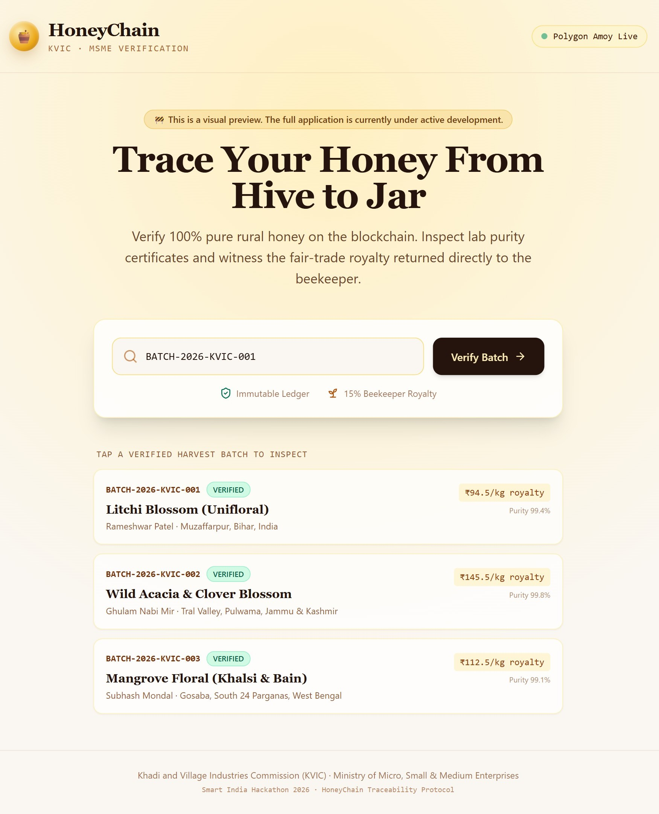
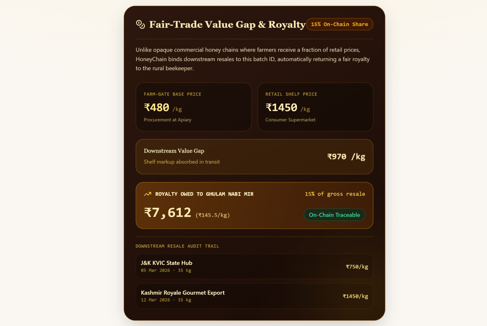
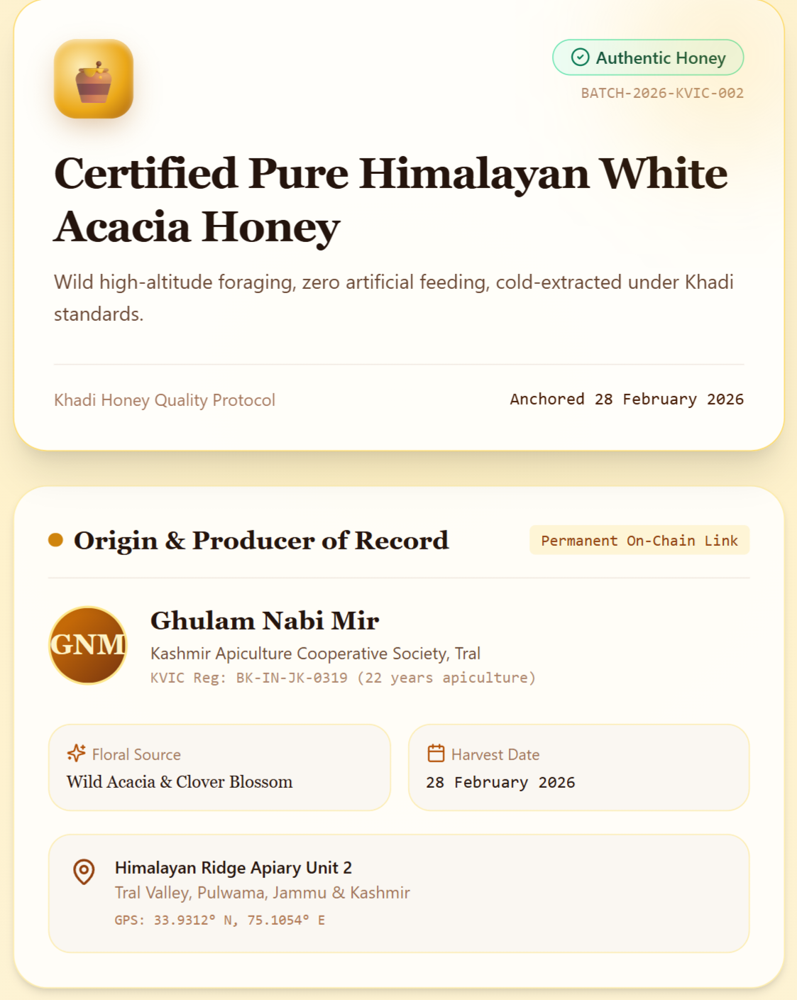
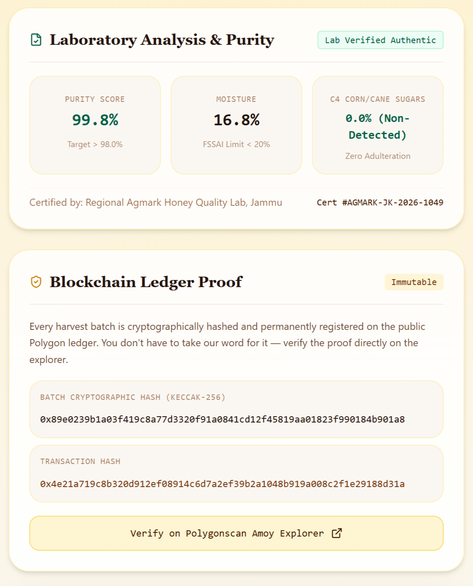
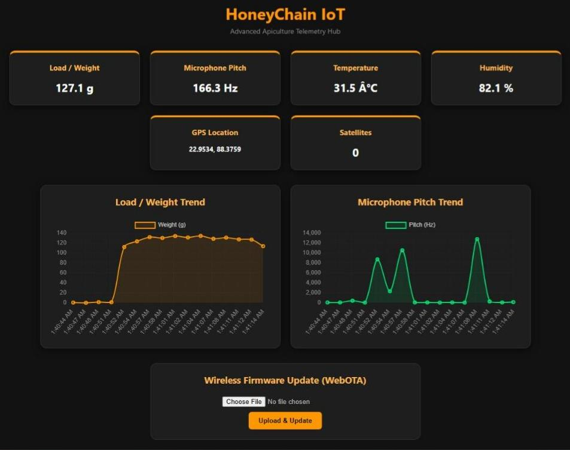
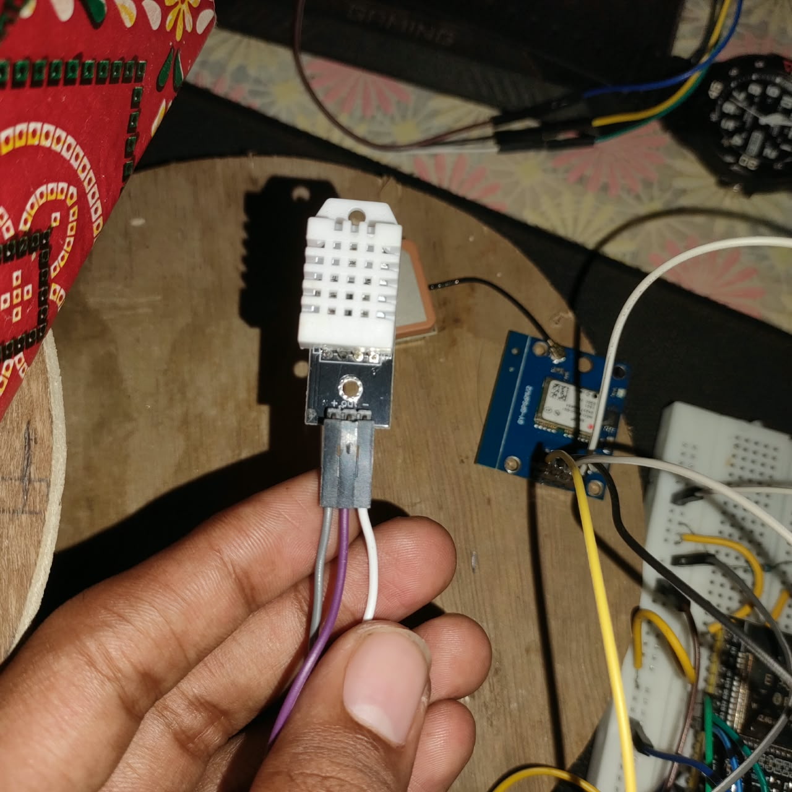

# 🍯 HoneyChain

**Blockchain-based Honey Traceability & Smart Beekeeping Management System**

> Honey that pays its beekeeper back — even after a brand relabels and resells it.

[](https://sih.gov.in/)
[]()
[]()
[]()
[](https://reactjs.org/)
[](https://nextjs.org/)
[](https://tailwindcss.com/)
[](https://www.chartjs.org/)
[](https://reactnative.dev/)
[](https://expo.dev/)
[](https://fastapi.tiangolo.com/)
[](https://www.python.org/)
[](https://jwt.io/)
[](https://www.postgresql.org/)
[](https://www.mongodb.com/)
[](https://ipfs.tech/)
[](https://aws.amazon.com/)
[](https://www.docker.com/)
[](https://docs.soliditylang.org/)
[](https://polygon.technology/)
[](https://docs.ethers.org/)
[](https://www.tensorflow.org/)
[](https://pytorch.org/)
[](https://www.espressif.com/)

---

## 📌 Problem Statement

**PS ID:** 26021 | **Organization:** Ministry of MSME | **Department:** Coordination Section | **Category:** Software | **Theme:** Agriculture, FoodTech & Rural Development

KVIC's Honey Mission supports rural beekeepers with bee boxes and extraction toolkits for livelihood promotion, but they still face counterfeit honey, low consumer trust, weak market linkages, and a lack of traceability and advanced hive management support. HoneyChain addresses this with an integrated blockchain, AI, and IoT-based digital ecosystem.

## 💡 Overview

HoneyChain is an end-to-end digital ecosystem that gives every jar of honey a verifiable, tamper-proof identity from hive to consumer. A consumer scans a QR code and instantly sees a blockchain-verified batch history — beekeeper, apiary location, harvest date, and lab purity results.

But the core problem HoneyChain solves goes deeper than authenticity. Raw honey sold by rural beekeepers is often relabeled and resold by intermediaries at a significant markup, with none of that value returning to the producer. HoneyChain's **blockchain-anchored royalty mechanism** makes every downstream resale of a batch publicly traceable — turning an invisible middleman margin into a transparent, provable, and enforceable producer royalty.

IoT-enabled hive sensors, hardware-secured data attestation, and AI-driven analytics complete the picture — giving beekeepers real-time colony health insights and giving their harvest a data-backed case for premium pricing.

## ✨ Key Features

- 🔍 **QR-Code Consumer Verification** — Instant, blockchain-backed proof of authenticity for every batch, viewable on any smartphone.
- ⛓️ **Blockchain Batch Anchoring** — Immutable, tamper-proof record of harvest data anchored on a public testnet ledger.
- 💰 **Royalty & Attribution Mechanism** — Smart contract–enforced tracking of downstream resale transactions, ensuring rural beekeepers receive fair, provable compensation.
- 📡 **IoT-Enabled Hive Monitoring** — Real-time temperature, humidity, and weight sensor data for environmental and colony health tracking.
- 🔒 **TEE-Secured Edge Data** — Hardware-level attestation of sensor readings at the point of capture, preventing data tampering before it ever reaches the blockchain.
- 🐝 **AI-Powered Disease Detection** — Image-based classification to identify bee diseases and pest infestation (e.g. varroa mites, foulbrood) for early intervention.
- 📈 **Productivity Prediction** — AI/ML-driven yield forecasting based on hive sensor trends and environmental data.
- 📱 **Beekeeper Mobile App** — Simple, icon-driven harvest logging, hive inspection records, and a royalty tracker — built for low-literacy, low-connectivity users.
- 🗺️ **KVIC Admin Dashboard** — Cluster-wide productivity, colony health, and disease-alert monitoring for scalable institutional oversight.

## 🏗️ Architecture

```
┌─────────────────────────────────────────────────────────────┐
│  Hive Edge Layer                                              │
│  IoT Sensors (temp/humidity/weight) + TEE Attestation         │
│  + Hive Camera (AI disease flags) + Beekeeper Mobile App      │
└───────────────────────────┬───────────────────────────────────┘
                            ▼
┌─────────────────────────────────────────────────────────────┐
│  Backend (FastAPI)                                             │
│  Ingestion & Analytics · Batch/QR Generation · Chain Anchoring │
└───────────────────────────┬───────────────────────────────────┘
                            ▼
┌─────────────────────────────────────────────────────────────┐
│  Data & Ledger Layer                                          │
│  PostgreSQL (operational data) · IPFS (photos/lab reports)    │
│  Blockchain (batch hash anchors + royalty claims)             │
└───────────────────────────┬───────────────────────────────────┘
                            ▼
┌───────────────────────────┬───────────────────────────────────┐
│  Consumer QR Page       │  KVIC Admin Dashboard & Farmer Dashboard│
│  Batch history + proof  │  Cluster monitoring + analytics         │
└─────────────────────────────────────────────────────────────┘
```

**Design principle:** only cryptographic hashes are stored on-chain — raw data (photos, lab reports, sensor logs) stays off-chain in PostgreSQL/IPFS. This keeps writes fast and cheap while every batch remains independently, cryptographically verifiable.

## 🛠️ Tech Stack

| Layer | Technologies |
|---|---|
| **Frontend (Web)** | React JS, Next.js, Tailwind CSS, Chart.js |
| **Mobile App** | React Native, Expo |
| **Backend** | FastAPI, Python, REST API, JWT Authentication |
| **Database** | PostgreSQL, MongoDB, IPFS |
| **Blockchain** | Solidity, Hardhat, Polygon (Amoy Testnet), Ethers.js |
| **AI / ML** | TensorFlow / PyTorch, TFLite (on-device inference) |
| **IoT / Edge Security** | ESP32, DHT22, HX711, ARM TrustZone (TEE) |
| **Cloud & Storage** | AWS S3, Docker |

## 📂 Repository Structure

```
honeychain/
├── contracts/           # Solidity smart contracts + deployment scripts
├── backend/              # FastAPI backend services
├── mobile-app/           # React Native beekeeper app
├── consumer-web/         # Next.js QR verification page
├── admin-dashboard/       # Next.js KVIC admin dashboard
├── iot-simulator/         # Sensor + TEE attestation simulator
├── ai-models/            # Disease detection & productivity prediction models
└── docs/                 # Architecture diagrams, demo script, pitch assets
```

## 🚀 Getting Started

### Prerequisites
- Node.js ≥ 18.x
- Python ≥ 3.10
- Docker & Docker Compose
- MetaMask wallet + Polygon Amoy testnet MATIC (from a faucet)

### Smart Contracts
```bash
cd contracts
npm install
npx hardhat run scripts/deploy.js --network amoy
```

### Backend
```bash
cd backend
cp .env.example .env
docker-compose up
```

### Consumer QR Verification Page
```bash
cd consumer-web
npm install
npm run dev
```

### Beekeeper Mobile App
```bash
cd mobile-app
npm install
npx expo start
```

### Admin Dashboard
```bash
cd admin-dashboard
npm install
npm run dev
```

Detailed setup instructions for each module are available in their respective directories.

## 🎬 Demo Flow

1. **Anchor** a harvest batch on-chain as the beekeeper.
2. **Claim/resell** the batch as a processor or brand at a marked-up price.
3. **Query** the royalty owed — publicly, from any unrelated wallet — proving the value gap is transparent and enforceable.
4. **Scan** the batch's QR code to view the full consumer-facing verification page, including live blockchain proof.

See [`docs/demo-script.md`](./docs/demo-script.md) for the full walkthrough.

### 🎬 Project Demo

| Demo 1 | Demo 2 |
|:---:|:---:|
|  |  |

| Demo 3 | Demo 4 |
|:---:|:---:|
|  |  |

| Demo 5 |
|:---:|
|  | 

### 📸 Prototype Gallery

| Full Circuit & Breadboard Setup | Platform & Load Cell Integration |
| :---: | :---: |
|  |  |

| Component Close-ups | |
| :---: | :---: |
| **HX711 Amplifier Board** | **NEO-6M GPS Module** |
|  |  |
| **DHT22 Sensor** | **INMP441 Microphone** |
|  |  |
| **ESP32 Microcontroller** |
|  |

## 🎯 Impact

| Stakeholder | Benefit |
|---|---|
| **Consumers** | Instant, verifiable proof of honey authenticity |
| **Rural Beekeepers** | Fair, traceable compensation for downstream resale value |
| **KVIC & Institutions** | Scalable oversight, productivity data, and market credibility |
| **Ecosystem** | Reduced counterfeiting, stronger market linkages, data-driven hive management |

## 🗺️ Roadmap

- [ ] Integration with UPI/KVIC disbursement systems for automated royalty payouts
- [ ] LoRaWAN support for low-connectivity rural deployments
- [ ] Multi-language support for the beekeeper mobile app
- [ ] Expanded AI disease-detection model trained on field-collected data
- [ ] Mainnet migration path and gas-cost optimization
## 🤝 Contributing

Contributions are welcome. Please open an issue to discuss proposed changes before submitting a pull request.

## 📄 License

This project is licensed under the MIT License — see the [LICENSE](./LICENSE) file for details.

## 🙏 Acknowledgements

Built for **Smart India Hackathon 2026** in response to Problem Statement 26021, presented by the **Ministry of MSME**, in support of **KVIC's Honey Mission** for rural livelihood promotion.
